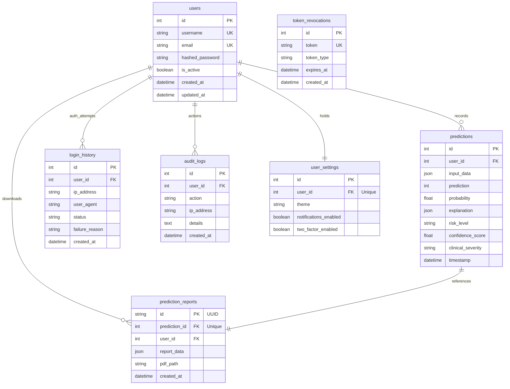

# NeuroHeart AI — Technical Architecture & Deployment Documentation

This document describes the software design patterns, folder structure, database models, API specs, and staging configurations implemented in the **NeuroHeart AI** cardiovascular SaaS platform.

---

## 1. Directory Structure

The project conforms to clean-code separation guidelines:

```
heart-disease-predictor/
├── .github/workflows/          # CI/CD pipelines
│   └── ci.yml                 # Automation test pipeline
├── app/                        # Server Application Root
│   ├── core/                  # Core modules
│   │   ├── config.py          # Environment settings
│   │   ├── database.py        # Connection setup & migrations
│   │   ├── security.py        # Cryptography and token blacklists
│   │   ├── logging.py         # JSON logs setup
│   │   └── dependencies.py    # DI parameters & rate limiters
│   ├── models/                # SQLAlchemy Models
│   │   └── (All tables defined inside app/models.py)
│   ├── schemas/               # Pydantic Schemas
│   │   └── (All DTO models defined inside app/schemas.py)
│   ├── repositories/          # Database Queries (Repository Pattern)
│   │   ├── base_repository.py
│   │   ├── user_repository.py
│   │   ├── prediction_repository.py
│   │   └── report_repository.py
│   ├── services/              # Business Logic (Service Layer)
│   │   ├── auth_service.py
│   │   ├── prediction_service.py
│   │   ├── report_service.py
│   │   └── analytics_service.py
│   ├── routers/               # HTTP Routers (Endpoints)
│   │   ├── auth.py
│   │   ├── prediction.py
│   │   ├── analytics.py
│   │   └── health.py
│   ├── utils/                 # Utilities
│   │   ├── pdf_generator.py   # PDF drawing
│   │   └── chart_generator.py # Matplotlib compiler
│   └── main.py                # FastAPI Initialization entrypoint
├── data/                       # Diagnostic csv files
├── models/                     # Scikit-learn pickle files
├── frontend/                   # Client Application Root (Vite + React)
│   ├── src/
│   │   ├── components/        # ECG waves, Wizard forms, SVG charts
│   │   ├── pages/             # Landing, Dashboards, History grids
│   │   ├── utils/             # api Axios client
│   │   └── App.jsx            # Routing manager
│   ├── package.json
│   └── vite.config.js
├── Dockerfile                  # Production container definitions
├── docker-compose.yml          # Staging environments setup
└── requirements.txt            # Python dependencies
```

---

## 2. Database Models (SQLite & PostgreSQL)

The platform supports **dynamic SQLite and PostgreSQL database pooling** based on connection strings. Foreign key constraints with cascade deletions are enforced programmatically.



---

## 3. Deployment & Staging Instructions

### Staging locally via Docker Compose
To build and spin up the complete production architecture locally, run:
```bash
docker-compose up --build
```
This launches:
- A PostgreSQL 15 database listening on port `5432` with persistent volumes.
- The Python FastAPI backend listening on port `8000`.

### Database Migrations (SQLite → PostgreSQL)
The application handles schema creation and database migrations automatically:
1. When configured with `DATABASE_URL` pointing to SQLite, it boots up and inspects if new columns are missing, running ALTER statements dynamically to preserve telemetry logs.
2. When configured with a PostgreSQL `DATABASE_URL` (in production/staging), it runs `Base.metadata.create_all` on startup, compiling constraints, cascade deletes, composite indexes, and relationships automatically.
3. Credentials should never be committed to source code. Set them in a `.env` file or environment panel.
